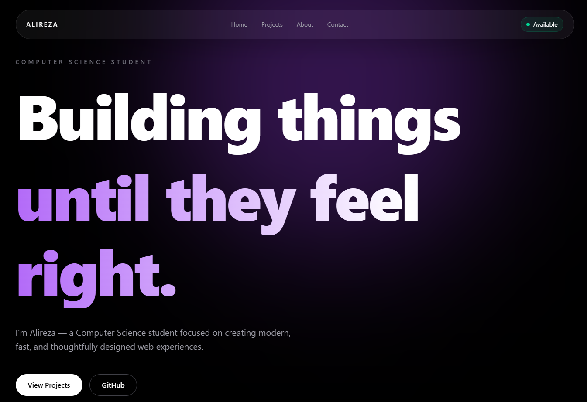
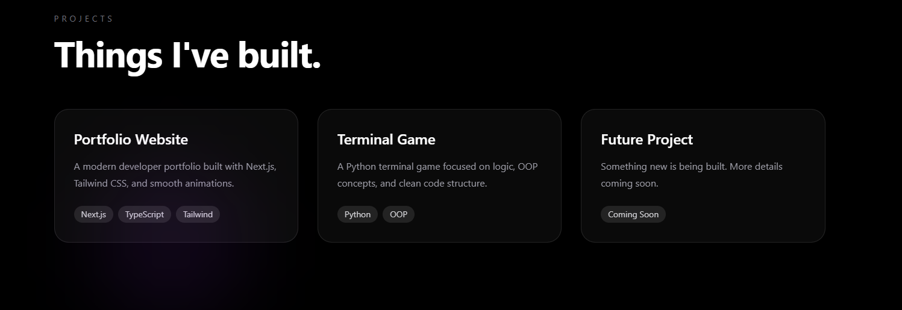
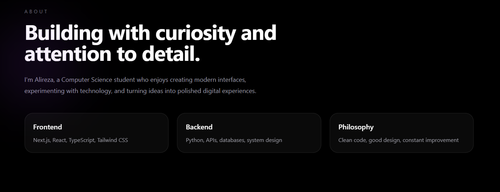
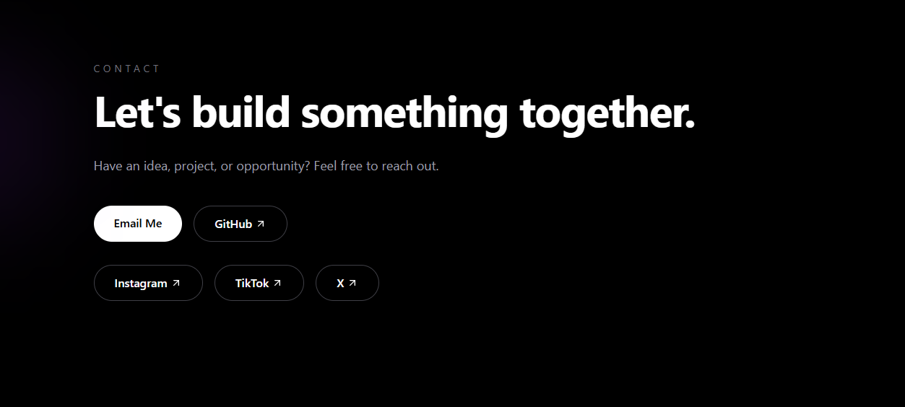

<div align="center">

# ✨ Alireza's Portfolio

A modern, minimal developer portfolio built with **Next.js**, **TypeScript**, and **Tailwind CSS**.

Designed with performance, clean aesthetics, and smooth interactions in mind.

<p>
  <a href="https://akbaridev.ir">
    
  </a>

  <a href="https://github.com/forgotTheAwait/Landing-page">
    
  </a>

  <a href="https://github.com/forgotTheAwait/Landing-page/stargazers">
    
  </a>
</p>

<p>
  
  
  
  
  
</p>

</div>

---

# 📸 Preview

<p align="center">

</p>

---

# ✨ Features

- 🎨 Modern & minimal UI
- ⚡ Built with Next.js 15
- 🎭 Smooth page animations
- 📱 Fully responsive
- 🌙 Dark theme
- 🚀 Optimized for performance
- 🧩 Reusable components
- 💼 Project showcase
- 📬 Contact section
- 🎯 Clean typography

---

# 🖼 Gallery

<table>
<tr>
<td width="50%">

### 💼 Projects



</td>

<td width="50%">

### 👨‍💻 About



</td>
</tr>

<tr>
<td colspan="2">

### 📬 Contact



</td>
</tr>
</table>

---

# 🛠 Tech Stack

| Category | Technologies |
|-----------|--------------|
| Framework | Next.js 15 |
| Language | TypeScript |
| Styling | Tailwind CSS |
| Animations | Framer Motion • GSAP |
| Deployment | Vercel |

---

# 🚀 Getting Started

Clone the repository

```bash
git clone https://github.com/forgotTheAwait/Landing-page.git
```

Move into the project

```bash
cd Landing-page
```

Install dependencies

```bash
npm install
```

Start the development server

```bash
npm run dev
```

Open

```
http://localhost:3000
```

---

# 📂 Project Structure

```text
.
├── app/
├── components/
├── public/
├── assets/
│   └── readme/
│       ├── home.png
│       ├── projects.png
│       ├── about.png
│       └── contact.png
├── lib/
└── README.md
```

---

# 🎯 Goals

This portfolio was built to showcase my work while focusing on:

- Clean design
- Responsive layouts
- Performance
- Smooth user experience
- Modern web technologies

---

# ⭐ Support

If you enjoyed this project, consider giving it a ⭐ on GitHub.

It helps others discover the project and motivates me to keep building.

---

<div align="center">

### 🌐 Live Website

https://akbaridev.ir

Made with ❤️ by **Alireza**

</div>
